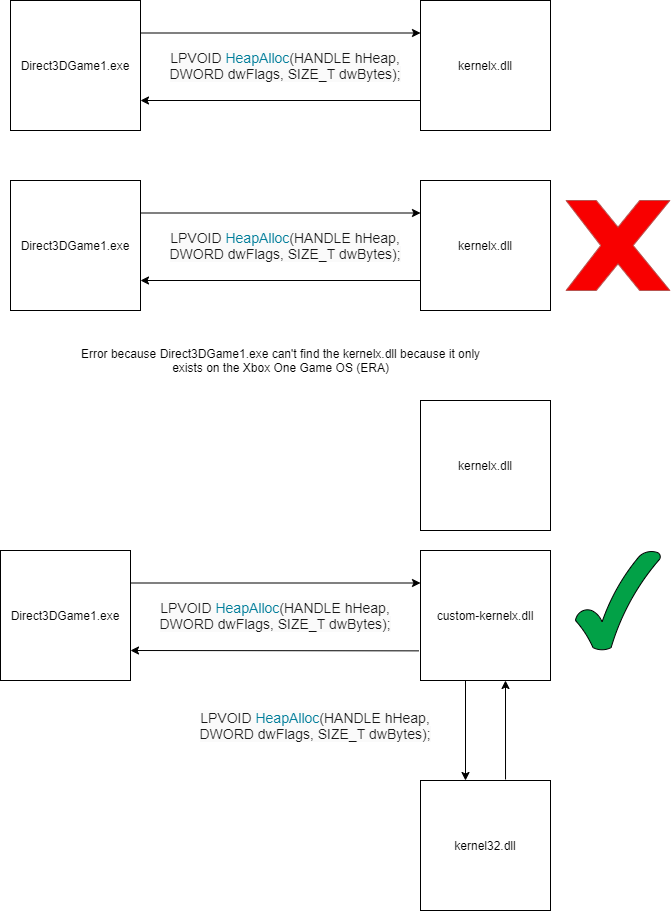

# XBONEmu
Home to the first Xbox One emulator. Eventually something will be here.

# Investigating the Xbox One Binaries

We need to fully understand the structure of the Xbox One binaries such as how the compare and contrast to that of there Windows (Windows Portable Executable or Windows PE for short) counterparts. This would allow us to know if there were any changes we would need to make to make sure that these binaries can even run on the host machine.

# Rerouting Xbox One Libaries

We need to get the Xbox One Binaries which are very similar to that of WinPE binaries to redirct from the Xbox One SDK libaries and kernel to the Windows 10 libaries and kernel. We could use [Microsoft Detours](https://github.com/microsoft/Detours) to redirect calls to these Xbox Libaries to that of ones on Windows. I think that using Microsoft Detours would be a good idea to start with.

# Example of How We Should Reroute

This is based on an example application that I made using the Xbox One SDK.

# Resources

[Inject your code to a Portable Executable file](https://www.codeproject.com/Articles/12532/Inject-your-code-to-a-Portable-Executable-file#Prerequisite1)
